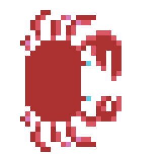
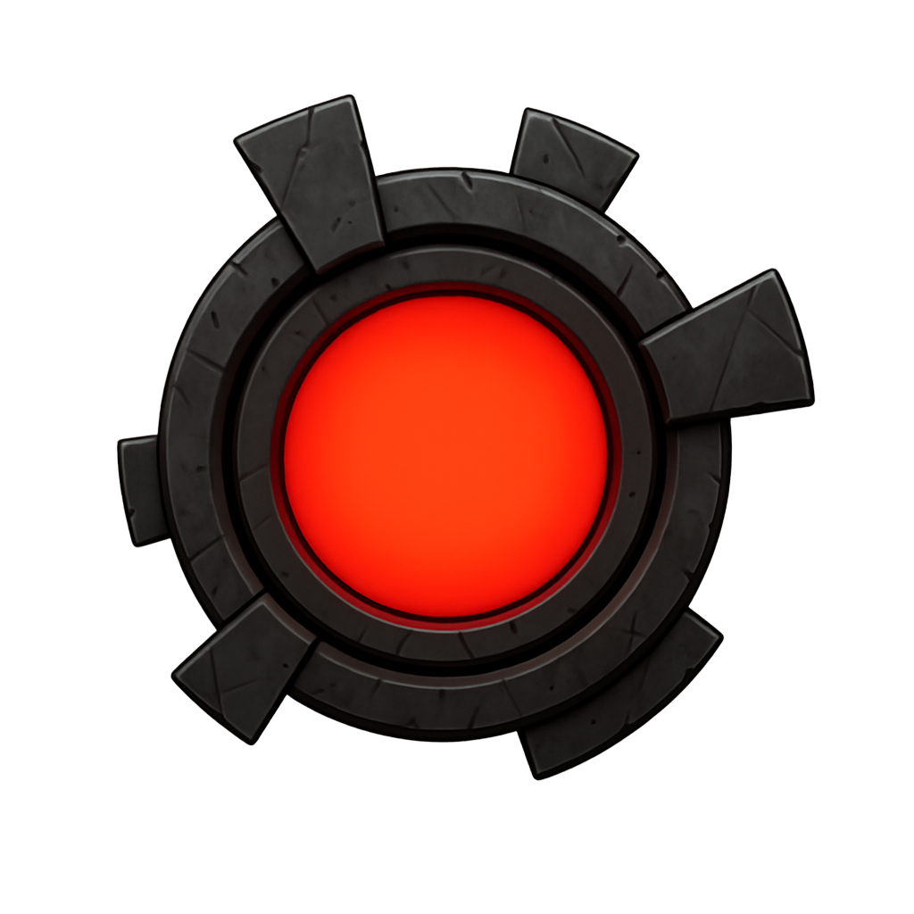
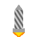
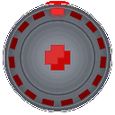
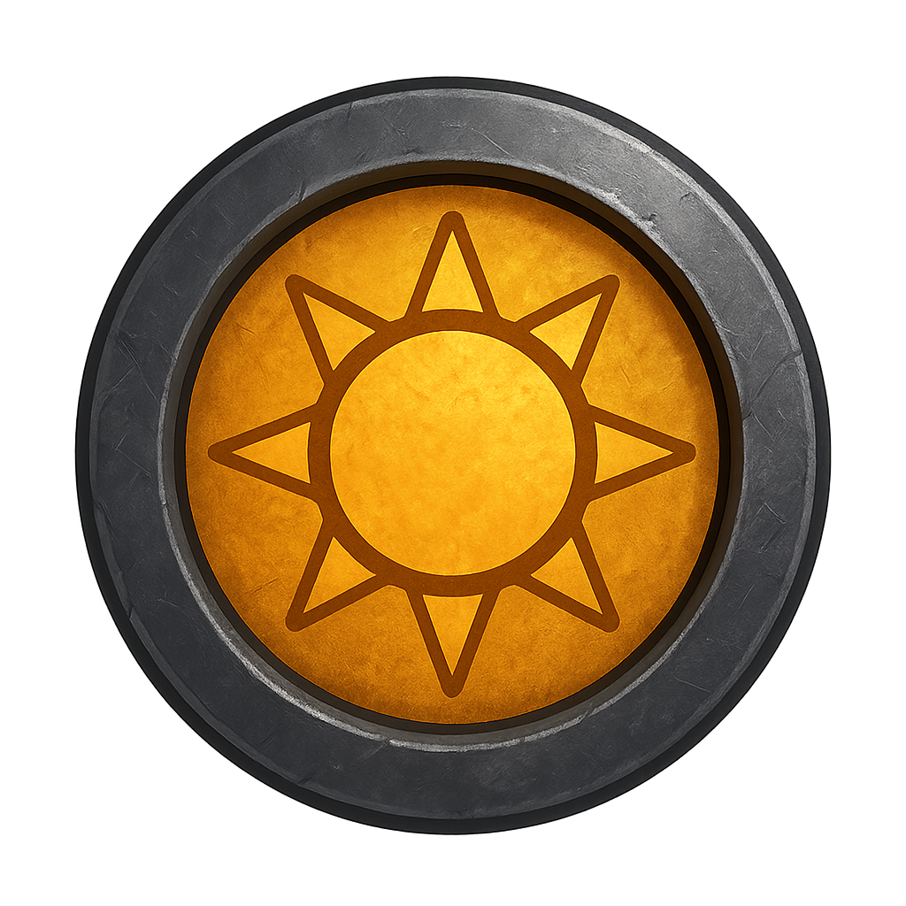
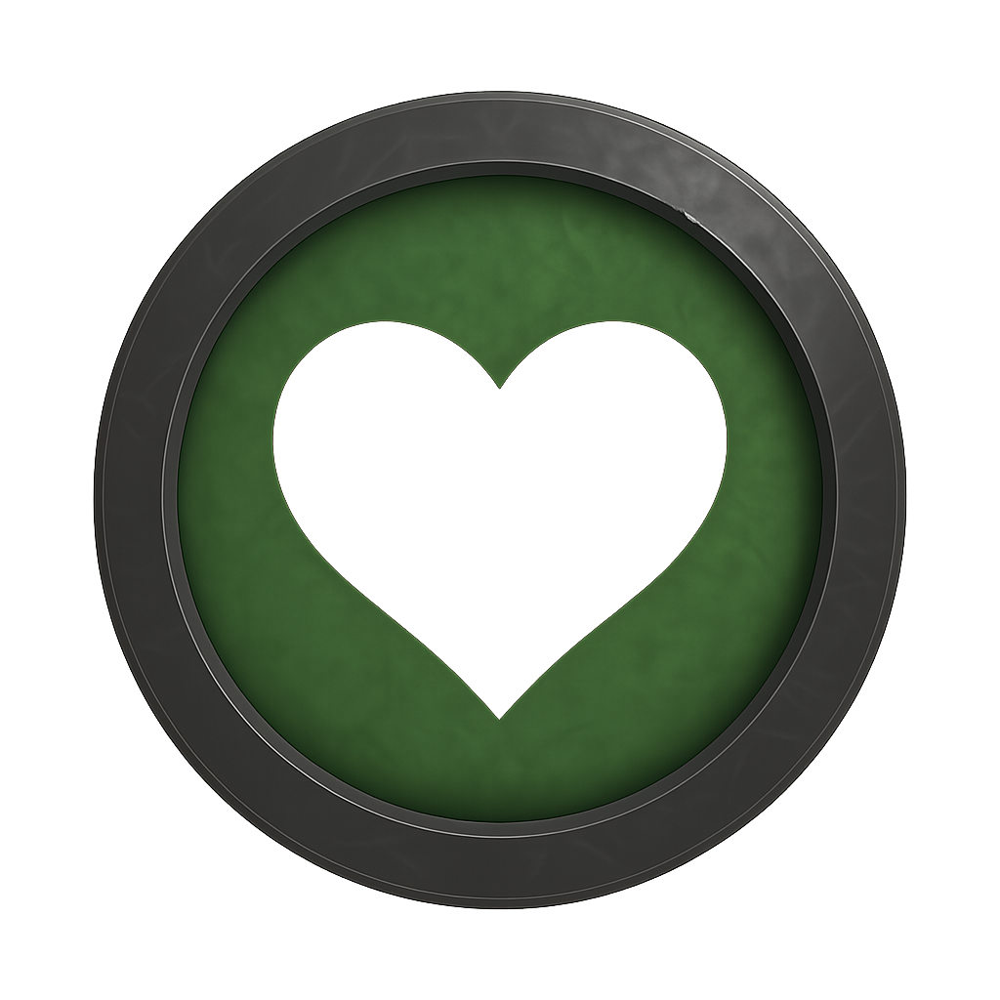
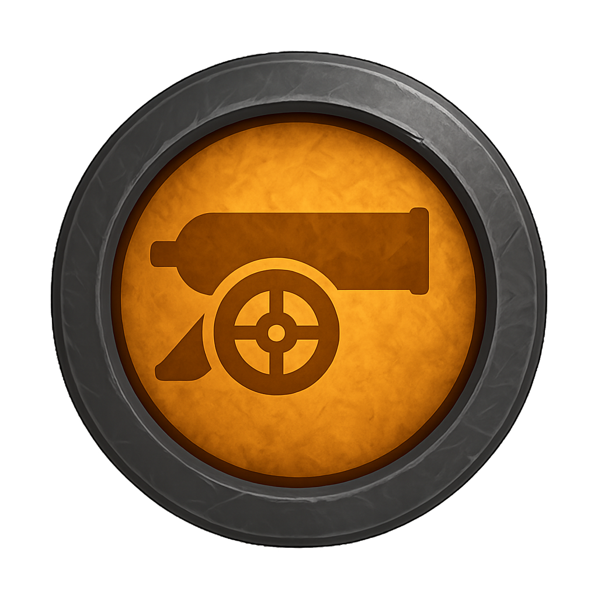

# LightBot - Příručka hry

## Základní princip hry

**LightBot** je akční hra, kde ovládáš robota (LightBot) uprostřed obrazovky. Tvá mise je přežít co nejdéle a zničit všechny nepřátele, kteří se na tebe valí ze všech stran.

### ⚠️ Důležité pravidlo: Jeden náraz = smrt
- **Jakýkoliv kontakt s nepřítelem znamená okamžitou smrt**
- Hra je velmi náročná - vyžaduje přesnost a rychlé reakce
- Při ztrátě extra života se objevíš znovu uprostřed obrazovky s malou ochrannou bombou

### 🌓 Princip dne a noci

Hra se střídá mezi **dnem** a **nocí**, každá fáze trvá 30 sekund:

#### **Den** (žlutý robot)
- Můžeš střílet **laserem** (levé tlačítko myši)
- Laser okamžitě zničí nepřátele při zásahu
- Robot má zlatou barvu

#### **Noc** (bílý robot)
- Laser nefunguje
- Místo toho můžeš použít **shockwave** (levé tlačítko myši)
- Shockwave vytvoří vlnu, která zničí nepřátele v určitém poloměru
- Shockwave má omezený počet použití (baterie)
- Robot má bílou barvu
- Pozadí je tmavší

## Nepřátelé

### 1. ⭐ Star (Hvězda)

- **Chování:** Přichází ve vlnách (wave patterns)
- **Popis:** Animovaná hvězda, která se pohybuje podle předem definovaných vzorů
- **Nebezpečí:** Střední - pohybuje se předvídatelně, ale ve vlnách může být jich hodně najednou
- **Jak zničit:** Laser ve dne, shockwave v noci

---

### 2. 🦀 Krab

- **Chování:** Nic nedělá, chodí do strany, potuluje se u kraje obrazovky
- **Popis:** Pasivní nepřítel, který se pohybuje horizontálně podél okrajů obrazovky
- **Nebezpečí:** Nízké - nepřítel tě přímo neohrožuje, ale může tě překvapit u okraje
- **Jak zničit:** Laser ve dne, shockwave v noci

---

### 3. 🎯 Prudic

- **Chování:** Naváděný přímo na LightBota
- **Popis:** Agresivní nepřítel, který tě přímo pronásleduje
- **Životy:** **5 životů** - musíš ho zasáhnout 5x, než ho zničíš
- **Nebezpečí:** Vysoké - jde přímo na tebe a vydrží více zásahů
- **Jak zničit:** Laser ve dne (5x), shockwave v noci (5x)

---

### 4. 🚀 Torpeda

- **Chování:** Naváděná na minu, když není mina, tak na playera
- **Popis:** Inteligentní nepřítel, který preferuje zničení min před útokem na hráče
- **Nebezpečí:** Vysoké - rychle se pohybuje a mění cíl podle situace
- **Strategie:** Polož miny, aby torpeda útočila na ně místo na tebe
- **Jak zničit:** Laser ve dne, shockwave v noci

---

### 5. 🛸 UFO

- **Chování:** Padají z něj bonusy
- **Popis:** Speciální nepřítel, který nese cenné bonusy
- **Nebezpečí:** Střední - může tě zranit, ale hlavně je zdrojem bonusů
- **Strategie:** Znič UFO, aby vypustil bonus, ale pozor - může tě také zranit!
- **Jak zničit:** Laser ve dne, shockwave v noci
- **Speciální vlastnost:** Po zničení vypustí náhodný bonus, který ještě nemáš.

---

## Bonusy

Bonusy padají z UFO po jejich zničení. Každý bonus můžeš sebrat **pouze jednou za hru**. Po sebrání se zobrazí v statusu jako "ano/ne".

### 💣 Světelná bomba

- **Efekt:** Aktivuje ultimátní zbraň - světelnou atomovou bombu
- **Použití:** Stiskni **Q** nebo **Enter** pro aktivaci
- **Co dělá:** Vytvoří obrovskou vlnu, která zničí všechny nepřátele na celé obrazovce
- **Dostupnost:** Můžeš mít pouze jednu za hru
- **Poznámka:** Můžeš začít hru s bombou (podle konfigurace)

---

### 💚 Extra život

- **Efekt:** Přidá ti jeden extra život
- **Co se stane při ztrátě života:**
  - Objevíš se znovu uprostřed obrazovky
  - Aktivuje se malá ochranná bomba (polovina obrazovky)
  - Všechny ostatní bonusy se resetují
- **Dostupnost:** Můžeš mít pouze jeden za hru
- **Důležité:** Po použití extra života ztratíš všechny ostatní bonusy.

---

### 🔫 Druhé dělo

- **Efekt:** Aktivuje druhé dělo, které střílí opačným směrem
- **Co dělá:** Máš nyní dvě děla - jedno střílí tam, kam míříš, druhé opačným směrem (180°)
- **Výhoda:** Dvojnásobná palebná síla
- **Dostupnost:** Můžeš mít pouze jeden za hru

---

### 💣 Extra miny

- **Efekt:** Zdvojnásobí maximální počet min, které můžeš položit
- **Co dělá:** Můžeš položit více min najednou
- **Výhoda:** Více min = lepší obrana a více pastí pro nepřátele
- **Dostupnost:** Můžeš mít pouze jeden za hru

---

### ⚡ Shockwave bonus

- **Efekt:** Zdvojnásobí poloměr shockwave vlny
- **Co dělá:** Tvá noční obrana (shockwave) má nyní větší dosah
- **Výhoda:** Zničíš více nepřátel najednou v noci
- **Dostupnost:** Můžeš mít pouze jeden za hru

---

### 🎯 Naváděné miny

- **Efekt:** Aktivuje naváděné miny místo statických
- **Co dělá:** Místo statických min, které zůstávají na místě, se miny nyní aktivně pohybují a navádějí na nejbližšího nepřítele
- **Výhoda:** Míny samy hledají a útočí na nepřátele
- **Chování:** Naváděné miny mají podobnou logiku jako torpeda - plynule se otáčí a pohybují k cíli
- **Dostupnost:** Můžeš mít pouze jeden za hru

---

## Ovládání

- **A/D** nebo **Šipky doleva/doprava** - otáčení děla
- **Q** nebo **Enter** - aktivace světelné bomby
- **Pravé tlačítko myši** - položení miny
- **Levé tlačítko myši** - výstřel laserem (den) nebo shockwave (noc)

---

**Hodně štěstí, LightBot!** 🚀

